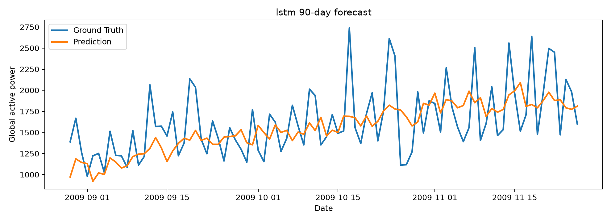
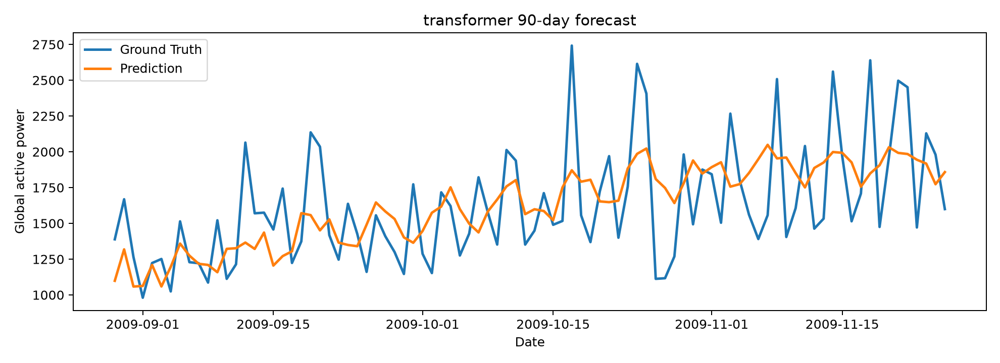
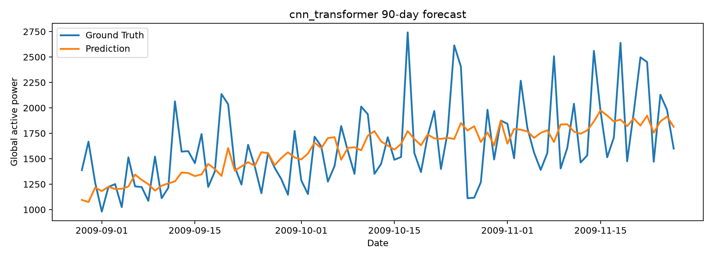
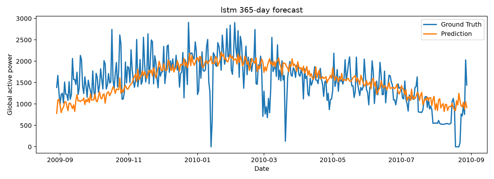
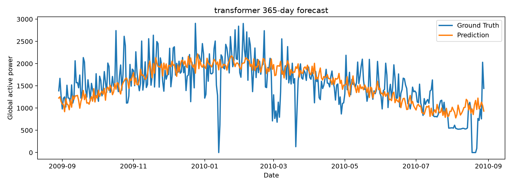
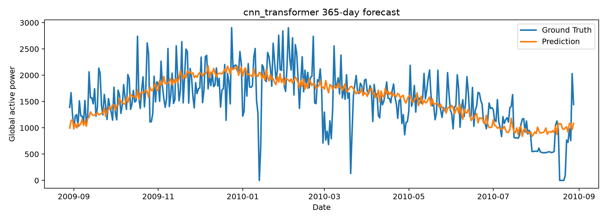

# 家庭电力消耗多变量时间序列预测实验报告

## 作者信息

- 姓名：魏宪正
- 学号：20255227057
- 团队人数：1 人
- 所属研究领域：大模型、RAG、Agent、多模态
- 贡献分工：本人独立完成数据处理、模型实现、实验训练、结果分析、图表绘制和报告撰写，贡献比例 100%。
- GitHub 代码链接：https://github.com/longevitywxz/machaintest

## 1. 问题介绍

本项目研究家庭电力消耗预测问题。数据来自 UCI Individual Household Electric Power Consumption，原始记录以分钟为粒度，包含全屋有功功率、无功功率、电压、电流以及三个子表能耗。按照课程要求，实验将分钟数据汇总为日级数据，其中 `global_active_power`、`global_reactive_power`、`sub_metering_1`、`sub_metering_2`、`sub_metering_3` 按天求和，`voltage` 和 `global_intensity` 按天求平均，并补充 `sub_metering_remainder` 与日期周期特征。外部天气信息来自 data.gouv / Meteo-France 的 92 省月度基础气象数据，按年月合并 `RR`、`NBJRR1`、`NBJRR5`、`NBJRR10`、`NBJBROU` 五个变量。

预测任务为使用过去 90 天的多变量序列预测未来总有功功率曲线，分别设置 90 天短期预测和 365 天长期预测。两种预测长度分别训练模型，评价指标为 MSE 和 MAE。每个模型在 5 个随机种子下重复实验，并报告均值和标准差。

## 2. 模型

### 2.1 LSTM

LSTM 将 90 天多变量序列按时间步输入循环网络，使用最后一层隐藏状态作为历史用电模式的表示，再通过全连接层直接输出未来 `horizon` 天的预测序列。该模型适合捕获局部趋势和中短期时序依赖。

### 2.2 Transformer

Transformer 首先将每日特征投影到隐藏维度，并加入正弦位置编码；随后使用多头自注意力编码 90 天历史序列，最后取最后一个时间步的表示输出未来曲线。相比 LSTM，Transformer 对长距离依赖建模更直接，但在小样本时间序列上更依赖正则化。

### 2.3 改进模型：CNN-Transformer

本文提出 CNN-Transformer 组合模型。模型先用一维卷积在时间轴上提取短期局部模式，例如连续几天的用电波动和周期片段；随后将卷积后的序列输入 Transformer 编码器建模长期依赖。最后使用均值池化表示与最后时间步表示的门控融合，输出未来曲线。该结构的动机是让卷积层承担局部平滑和局部模式抽取，减少 Transformer 在小样本长期预测中的学习难度。

简化伪代码如下：

```text
Input: X in R^(90 x d), horizon H in {90, 365}
Local feature extraction:
    Z = GELU(Conv1D(X, kernel=5))
    Z = GELU(Conv1D(Z, kernel=3))
Long dependency encoding:
    E = TransformerEncoder(PositionalEncoding(Z))
Gated fusion:
    c_mean = MeanPool(E)
    c_last = E[-1]
    gate = Sigmoid(W_g c_last + b_g)
Prediction:
    y_hat = Linear(LayerNorm(c_mean * gate))
Output: y_hat in R^H
```

结构流程可概括为：

```text
90-day multivariate input
        |
   1D CNN local filters
        |
 positional encoding
        |
 Transformer encoder
        |
 mean pooling + last-state gate
        |
 90-day / 365-day power forecast
```

## 3. 结果与分析

五轮实验的均值和标准差如下：

| Model | Horizon | MSE mean | MSE std | MAE mean | MAE std |
|---|---:|---:|---:|---:|---:|
| cnn_transformer | 90 | 129159.2437 | 7296.4681 | 290.4032 | 4.6883 |
| cnn_transformer | 365 | 183649.8219 | 5895.9951 | 317.8872 | 5.9485 |
| lstm | 90 | 133342.4484 | 5376.8680 | 287.7117 | 6.1816 |
| lstm | 365 | 201265.6906 | 11677.7138 | 334.2870 | 10.1218 |
| transformer | 90 | 129397.1687 | 10390.9455 | 288.8875 | 15.0631 |
| transformer | 365 | 187903.0125 | 1407.9032 | 319.3780 | 3.9562 |

预测曲线如下：








从任务性质看，90 天预测通常更容易保持趋势和幅值稳定；365 天预测需要跨季节建模，误差会明显增大。本次结果中，CNN-Transformer 在 365 天长期预测上的 MSE 和 MAE 均优于 LSTM，并接近 Transformer；在 90 天预测中，CNN-Transformer 的 MSE 接近 Transformer，但 MAE 略高于 LSTM 和 Transformer。该现象说明卷积层提取的局部平滑特征有助于长期趋势建模，但也可能削弱短期尖峰的拟合能力。家庭用电序列存在较强的日内/周内随机性，直接用日级序列预测 365 天会使模型更倾向于学习平滑趋势，而难以恢复真实曲线中的高频波动。

CNN-Transformer 的优势主要来自两点：第一，一维卷积在 Transformer 前先整合邻近日子的局部模式，降低注意力层直接从原始噪声中学习长期关系的难度；第二，均值池化与最后状态门控融合兼顾整体趋势和最近状态。其不足也比较明显：月度天气变量对每天都相同，时间粒度较粗；同时训练样本数量有限，CNN 与 Transformer 叠加后参数更多，短期任务上容易出现轻微过平滑。因此后续可增加逐日气象、节假日和异常用电标记，并考虑趋势-残差分解或多尺度卷积来改善尖峰预测。

## 4. 讨论

本实验使用直接多步预测，而不是递归单步预测，因此避免了递归误差逐步累积，但要求模型一次性学习完整未来曲线。对家庭电力数据而言，日期周期特征可以提供星期和月份信息，天气特征提供降水和雾等外部环境信息，帮助模型拟合生活规律、季节性变化和气候影响。后续改进可以加入更细粒度的逐日气象、节假日特征，或采用分解式预测方法先建模趋势与季节项，再预测残差。

本报告撰写过程中使用了 ChatGPT/Codex 辅助整理文字和代码结构；模型设计、实验运行与结果分析仍需以仓库中的可复现实验输出为准。

## 参考文献

[1] UCI Machine Learning Repository. Individual household electric power consumption. https://archive.ics.uci.edu/dataset/235/individual+household+electric+power+consumption

[2] data.gouv / Meteo-France. Donnees climatologiques de base mensuelles. https://www.data.gouv.fr/fr/datasets/donnees-climatologiques-de-base-mensuelles/

[3] Vaswani, A. et al. Attention Is All You Need. NeurIPS, 2017.

[4] Hochreiter, S., Schmidhuber, J. Long Short-Term Memory. Neural Computation, 1997.

[5] 课程作业说明《2026年专硕机器学习课程项目》。
